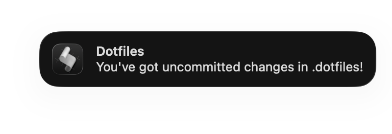

# Dotfiles

Personal configuration for zsh, tmux, git, oh-my-posh, and related tools. Uses [GNU Stow](https://www.gnu.org/software/stow/) for symlink management.

## Contents

```
.dotfiles/
├── .config/
│   ├── bat/
│   │   └── config
│   ├── ohmyposh/
│   │   ├── powerlevel10k_lean.omp.toml
│   │   ├── powerlevel10k_lean.omp.yaml
│   │   └── zen.toml
│   └── thefuck/
│       ├── rules
│       └── settings.py
├── .cursor/
│   ├── cli-config.json
│   └── mcp.json
├── Library/
│   ├── Application Support/
│   │   └── Cursor/
│   │       └── User/
│   │           ├── keybindings.json
│   │           └── settings.json
│   └── LaunchAgents/
│       └── com.dotfiles.watch.plist
├── .gitconfig
├── .p10k.zsh
├── .tmux.conf
├── .zshrc
├── scripts/
│   └── dotfiles-watch.sh
└── README.md
```

### 💻 cursor
IDE settings, keybindings, MCP config, and CLI config.

### 🔀 git
User identity, aliases, and core git configuration.

### ✨ oh-my-posh
Prompt theme configs (powerlevel10k-style and zen).

### 🐚 zshrc
Uses oh-my-posh and zinit, plus other goodies (see below).

### ➗ tmux
TPM for plugins, Nord theme.

### 🦇 bat
Nord theme config.

### 😤 the fuck
Alias correction rules and settings.

## 🛠️ Prerequisites

- [Homebrew](https://brew.sh)
- [GNU Stow](https://www.gnu.org/software/stow/) (`brew install stow`)

### Integrations

```bash
brew install fzf zoxide thefuck bat
```

### Font (for oh-my-posh)

```bash
brew install --cask font-hasklug-nerd-font
```

### Oh-my-posh

```bash
brew install jandedobbeleer/oh-my-posh/oh-my-posh
```

## 🚀 Installation

1. Clone the repo:

   ```bash
   git clone https://github.com/kstlouis/dotfiles.git ~/.dotfiles
   cd ~/.dotfiles
   ```

2. Stow the dotfiles into `$HOME`:

   ```bash
   stow .
   ```

   Stow creates symlinks in your home directory, mirroring the repo's structure. 
   When running it for the first time, be extra sure that you're in the dotfiles root (`~/.dotfiles`) — stow won’t act on anything above the directory you’re in.
   
   > [!NOTE]
   > Stow does not replace existing files — delete or rename any conflicting dotfiles in your home directory before running stow.

3. Install tmux plugins:

   ```bash
   git clone https://github.com/tmux-plugins/tpm ~/.tmux/plugins/tpm
   ```

   Then start tmux and press `Prefix` + <kbd>I</kbd> to install all plugins.

## 🔔 Dotfiles watcher

(Optional) Sends a macOS notification when you have uncommitted changes in the repo. Polls every hour; won’t re-notify for 6 hours (at most a few times per day).

<p align="center"></p>

**Run at login**: After stowing, load the LaunchAgent:
```bash
launchctl load ~/Library/LaunchAgents/com.dotfiles.watch.plist
```

To stop, use `launchctl unload` instead

## ➡️ Shell Setup

- [**Zinit**](https://github.com/zdharma-continuum/zinit) – Plugin manager; auto-installs on first run
- [**Oh-my-posh**](https://ohmyposh.dev/) – Prompt (used in iTerm; skipped in macOS Terminal)
- **Plugins** – [zsh-syntax-highlighting](https://github.com/zsh-users/zsh-syntax-highlighting), [zsh-autosuggestions](https://github.com/zsh-users/zsh-autosuggestions), [fzf-tab](https://github.com/Aloxaf/fzf-tab), [zoxide](https://github.com/ajeetdsouza/zoxide), [thefuck](https://github.com/nvbn/thefuck)
